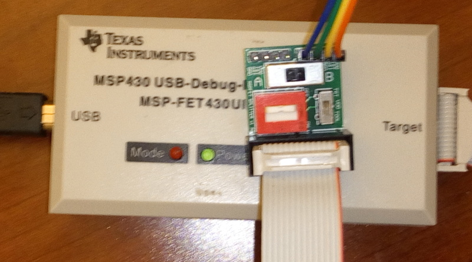

# Adapter from MSP-FET 14-pin to two TI Spy-bi-wire 0.100 4-pin headers

This adapter board is useful for connecting the MSP-FET standalone
device to custom boards with 2-pin Spy-bi-wire debug insterface.

This board features:

* A selector switch for whether to supply power to the target
device (i.e. target can be powered-by-FET or self-powered, where
FET only senses voltage without supplying any current).
* A 4PST switch to easily and fully disconnect FET from target device
without unplugging the header
* A split function to connect the FET to two target devices and easily
switch between them without replugging the header, implemented by
a 4PDT switch

Couple this adapter board with a [4-pin 0.050\'\' to 0.100\'\' Header
Adapter](https://github.com/CMUAbstract/adapter-50-100mil) and common [0.1
female/female jumper wires](https://www.adafruit.com/product/266) to connect a
standalone MSP-FET device to [WISP5](https://wisp5.wikispaces.com) and other
devices with 4-pin 0.050 programming header.

BOM
---

| Qty | Mfg PN       | Digikey PN  | Description |
| --- | ------------ | ----------- | ----------- |
| 1   | FS401N-2-Z   | 563-1568-ND | SWITCH SLIDE 4PDT 300MA 30V |
| 1   | 78H01T       | GH7198-ND   | SWITCH SLIDE DIP 4PST 150MA 30V |
| 1   | MFS101D-15-Z | 563-1554-ND | SWITCH SLIDE SPDT 200MA 12v |
| 1   | 302-S141     | ED10522-ND  | CONN HEADER VERT 14POS GOLD |
| 2   | ?            | ?           | 4-pin 0.100 male header |

Known bugs
----------

The 4PDT selector switch is wired such that to select the A output,
the switch must be in the right-hand position (instead of the
intuitive left-hand position).
